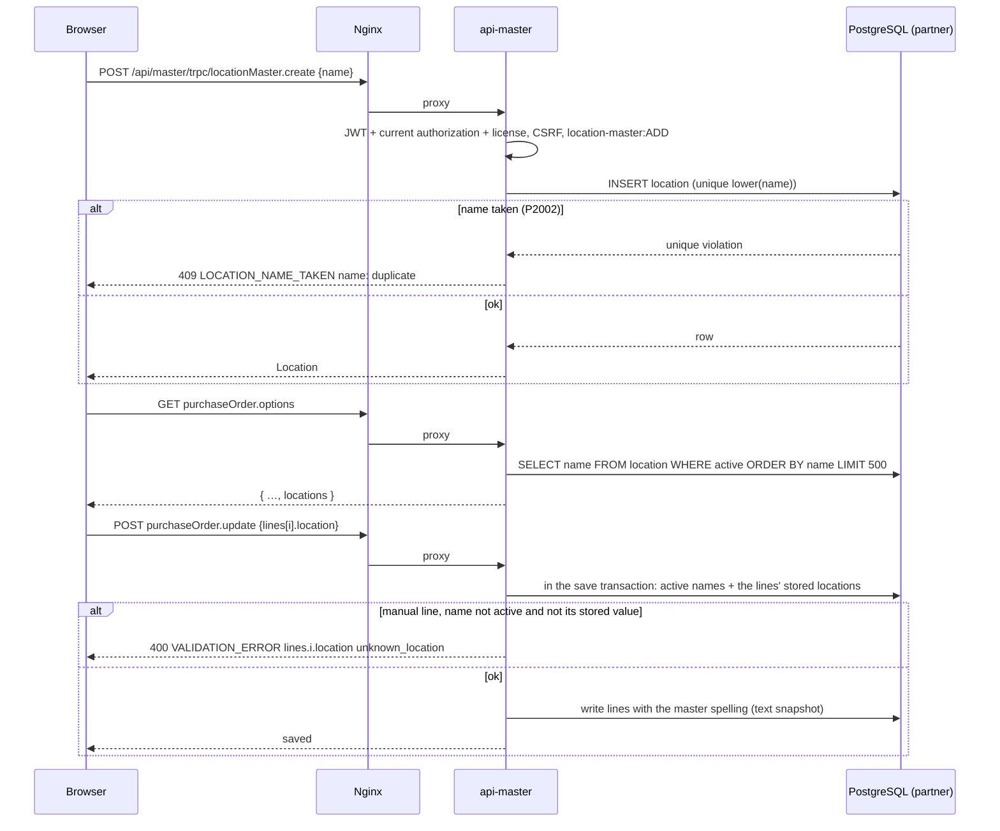

# Location Master — sequences (SA revision 1, approved 2026-11-16)

Main user flow: [diagram/location-master-flow.md](../../../../diagram/location-master-flow.md).

```mermaid
sequenceDiagram
  participant U as Browser
  participant N as Nginx
  participant M as api-master
  participant DB as PostgreSQL (partner)
  U->>N: POST /api/master/trpc/locationMaster.create {name}
  N->>M: proxy
  M->>M: JWT + current authorization + license, CSRF, location-master:ADD
  M->>DB: INSERT location (unique lower(name))
  alt name taken (P2002)
    DB-->>M: unique violation
    M-->>U: 409 LOCATION_NAME_TAKEN name: duplicate
  else ok
    DB-->>M: row
    M-->>U: Location
  end

  U->>N: GET purchaseOrder.options
  N->>M: proxy
  M->>DB: SELECT name FROM location WHERE active ORDER BY name LIMIT 500
  M-->>U: { …, locations }

  U->>N: POST purchaseOrder.update {lines[i].location}
  N->>M: proxy
  M->>DB: in the save transaction: active names + the lines' stored locations
  alt manual line, name not active and not its stored value
    M-->>U: 400 VALIDATION_ERROR lines.i.location unknown_location
  else ok
    M->>DB: write lines with the master spelling (text snapshot)
    M-->>U: saved
  end
```
