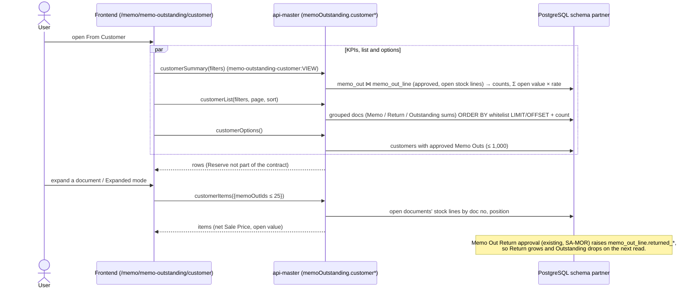

# Sequence diagram: memo-outstanding-customer (SA revision 1, approved 2026-11-03)

```mermaid
sequenceDiagram
  actor U as User
  participant FE as Frontend (/memo/memo-outstanding/customer)
  participant M as api-master (memoOutstanding.customer*)
  participant DB as PostgreSQL schema partner

  U->>FE: open From Customer
  par KPIs, list and options
    FE->>M: customerSummary(filters) (memo-outstanding-customer:VIEW)
    M->>DB: memo_out ⋈ memo_out_line (approved, open stock lines) → counts, Σ open value × rate
    FE->>M: customerList(filters, page, sort)
    M->>DB: grouped docs (Memo / Return / Outstanding sums) ORDER BY whitelist LIMIT/OFFSET + count
    FE->>M: customerOptions()
    M->>DB: customers with approved Memo Outs (≤ 1,000)
  end
  M-->>FE: rows (Reserve not part of the contract)
  U->>FE: expand a document / Expanded mode
  FE->>M: customerItems({memoOutIds ≤ 25})
  M->>DB: open documents' stock lines by doc no, position
  M-->>FE: items (net Sale Price, open value)

  Note over DB: Memo Out Return approval (existing, SA-MOR) raises memo_out_line.returned_*,<br/>so Return grows and Outstanding drops on the next read.
```
