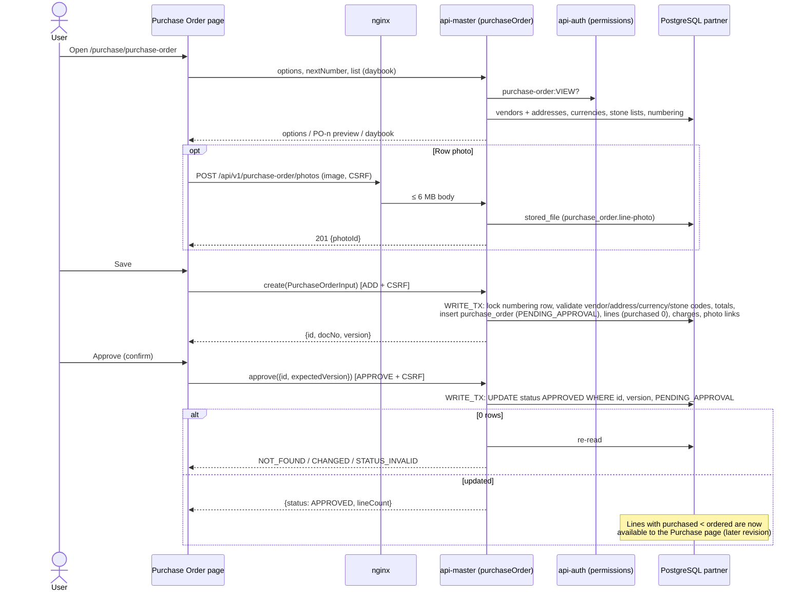

# Sequence diagram: purchase-order (SA revision 1, approved 2026-11-04)

```mermaid
sequenceDiagram
  actor U as User
  participant FE as Purchase Order page
  participant NG as nginx
  participant API as api-master (purchaseOrder)
  participant AUTH as api-auth (permissions)
  participant DB as PostgreSQL partner

  U->>FE: Open /purchase/purchase-order
  FE->>API: options, nextNumber, list (daybook)
  API->>AUTH: purchase-order:VIEW?
  API->>DB: vendors + addresses, currencies, stone lists, numbering
  API-->>FE: options / PO-n preview / daybook

  opt Row photo
    FE->>NG: POST /api/v1/purchase-order/photos (image, CSRF)
    NG->>API: ≤ 6 MB body
    API->>DB: stored_file (purchase_order.line-photo)
    API-->>FE: 201 {photoId}
  end

  U->>FE: Save
  FE->>API: create(PurchaseOrderInput) [ADD + CSRF]
  API->>DB: WRITE_TX: lock numbering row, validate vendor/address/currency/stone codes, totals,<br/>insert purchase_order (PENDING_APPROVAL), lines (purchased 0), charges, photo links
  API-->>FE: {id, docNo, version}

  U->>FE: Approve (confirm)
  FE->>API: approve({id, expectedVersion}) [APPROVE + CSRF]
  API->>DB: WRITE_TX: UPDATE status APPROVED WHERE id, version, PENDING_APPROVAL
  alt 0 rows
    API->>DB: re-read
    API-->>FE: NOT_FOUND / CHANGED / STATUS_INVALID
  else updated
    API-->>FE: {status: APPROVED, lineCount}
    Note over DB: Lines with purchased < ordered are now<br/>available to the Purchase page (later revision)
  end
```
