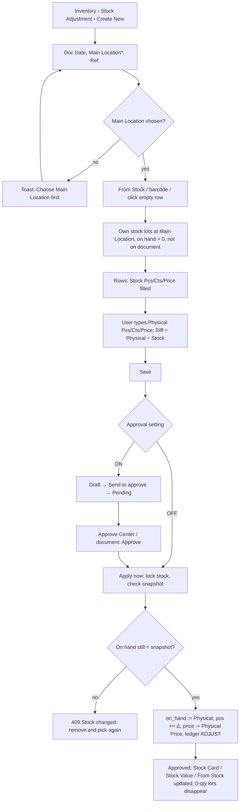

# Flow: stock-adjustment (UI rev 1 / SA rev 1, approved 2026-11-24)

```mermaid
flowchart TD
  A[Inventory › Stock Adjustment › Create New] --> B[Doc Date, Main Location*, Ref.]
  B --> C{Main Location chosen?}
  C -- no --> C1[Toast: Choose Main Location first] --> B
  C -- yes --> D[From Stock / barcode / click empty row]
  D --> E[Own stock lots at Main Location, on hand > 0, not on document]
  E --> F[Rows: Stock Pcs/Cts/Price filled]
  F --> G[User types Physical Pcs/Cts/Price; Diff = Physical − Stock]
  G --> H[Save]
  H --> I{Approval setting}
  I -- OFF --> J[Apply now: lock stock, check snapshot]
  I -- ON --> K[Draft → Send to approve → Pending] --> L[Approve Center / document: Approve] --> J
  J --> M{On hand still = snapshot?}
  M -- no --> N[409 Stock changed: remove and pick again]
  M -- yes --> O[on_hand := Physical, pcs += Δ, price := Physical Price, ledger ADJUST]
  O --> P[Approved; Stock Card / Stock Value / From Stock updated; 0-qty lots disappear]
```
